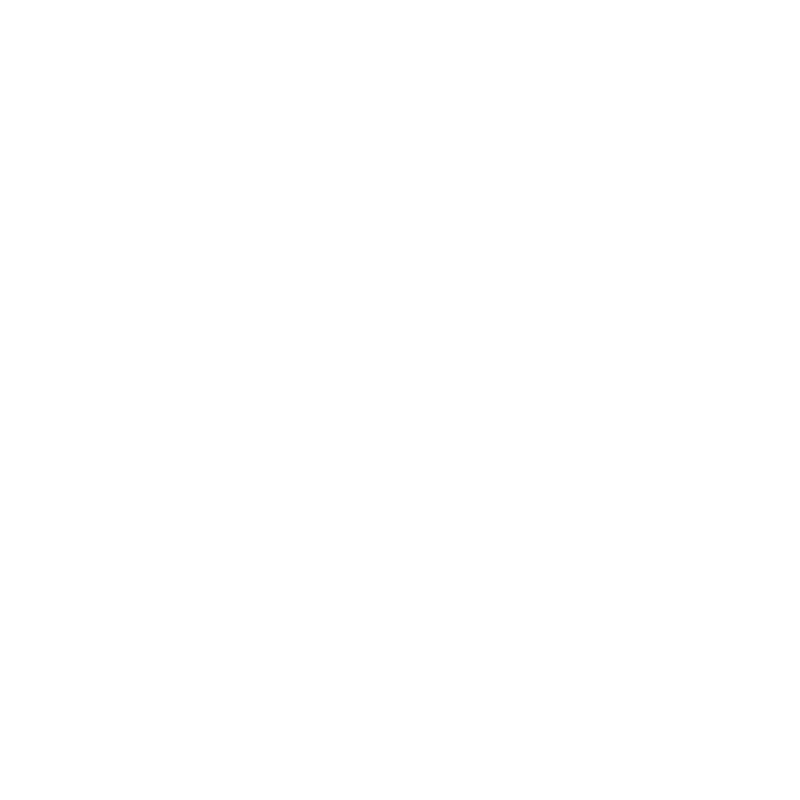
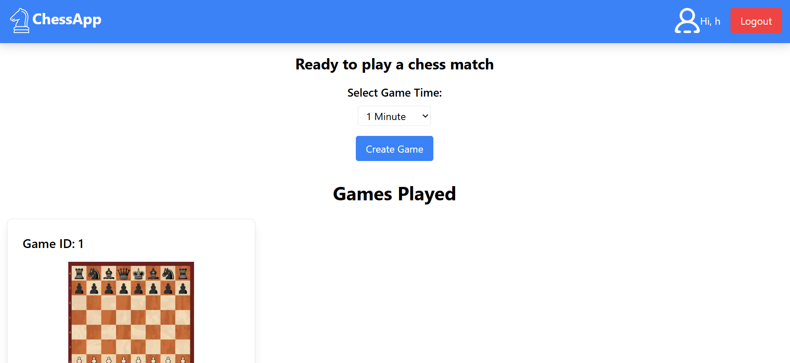

<p align="center">
  
</p>

<h1 align="center">ChessApp</h1>

<p align="center">
  A real-time multiplayer chess application built with React, Node.js, and Socket.IO.
</p>



---

## Features

- **Real-Time Gameplay**: Play chess with friends or random opponents in real-time.
- **Timer Support**: Configurable timers for competitive matches.
- **Role Assignment**: Automatic assignment of white and black roles.
- **Responsive Design**: Optimized for both desktop and mobile devices.
- **User Authentication**: Secure login and user management.
- **Game Persistence**: Save and load games using a backend database.

---

## Tech Stack

### Frontend
- **React**: For building the user interface.
- **Socket.IO Client**: For real-time communication.
- **Tailwind CSS**: For styling.
- **Vite**: For fast development and build tooling.

### Backend
- **Node.js**: For server-side logic.
- **Express**: For handling API routes.
- **Socket.IO**: For WebSocket-based real-time communication.
- **Redis**: For session management and game state storage.

### Deployment
- **Docker**: For containerized deployment.
- **Nginx**: For reverse proxy and static file serving.

---

## Getting Started

### Prerequisites
- **Node.js** (v18 or higher)
- **Docker** (optional, for containerized deployment)
- **Redis** (for game state storage)

### Installation

1. Clone the repository:
   ```bash
   git clone https://github.com/your-username/chessApp.git
   cd chessApp
   ```

2. Install dependencies for both frontend and backend:
   ```bash
   cd frontend
   npm install
   cd ../backend
   npm install
   ```

3. Start the Redis server (if not using Docker):
   ```bash
   redis-server
   ```

4. Run the application:
   ```bash
   docker-compose up --build
   ```

5. Access the application at `http://localhost`.


### Hosting on DigitalOcean

The application is hosted on a DigitalOcean droplet. The following services are used for hosting and security:

- **Cloudflare**: Manages DNS and provides additional security features like DDoS protection.
- **Let's Encrypt**: Provides a free SSL certificate for secure HTTPS connections.

To replicate the hosting setup:

1. Deploy the application on a DigitalOcean droplet using Docker or a manual setup.
2. Point your domain's DNS to the droplet's IP address using Cloudflare.
3. Use Certbot to obtain and renew an SSL certificate from Let's Encrypt:
   ```bash
   sudo certbot --nginx
   ```

4. Ensure Nginx is configured to serve the application over HTTPS.

---

## Contributing

Contributions are welcome! To contribute:

1. Fork the repository.
2. Create a new branch for your feature or bugfix:
   ```bash
   git checkout -b feature-name
   ```
3. Commit your changes:
   ```bash
   git commit -m "Add feature-name"
   ```
4. Push to your branch:
   ```bash
   git push origin feature-name
   ```
5. Open a pull request.

---

## License

This project is licensed under the MIT License. See the [LICENSE](./LICENSE) file for details.
